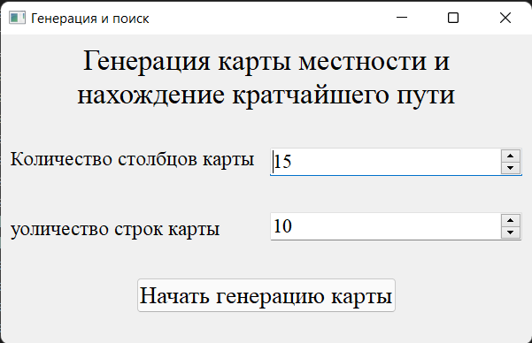
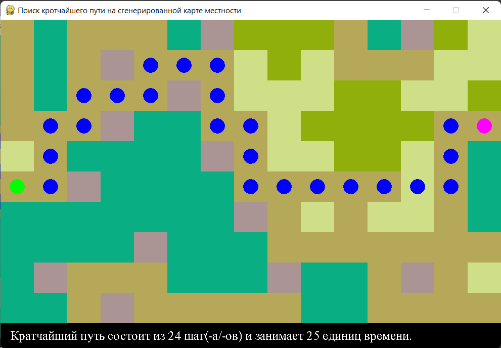

# wfc_and_a_star_algorithm
Generating a terrain map using wave function collapse algorithm and finding the optimal path using the A star algorithm
## Start
The code needs to be run from the **_menu.py_** file.
## Purpose of files
- **_menu.py_** - Application menu in which the size of the terrain map is selected and its generation is started.
- **_draw.py_** - Contains all drawing functions, terrain and shortest path maps, and a destination selection function for finding the shortest path. From the draw_best_way function it contains, the function for generating the terrain map and finding the optimal path is called.
- **_wave_function_collapse.py_** - Contains the functions necessary to create a map of the area for a given example.
- **_a_star_algorithm.py_** - Contains functions necessary to find the optimal path along the terrain graph.
## Example of program execution
### Start menu of the program.

### A generated terrain map window where you can select a destination and see the shortest path to it.

